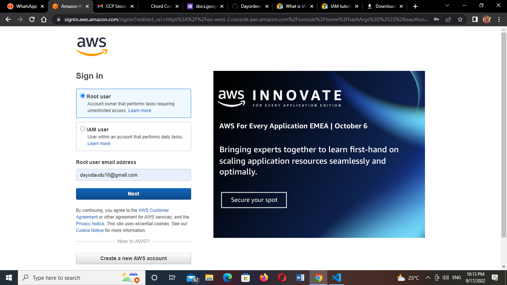

# Identity and Access Management (IAM)

## Task

1. Login on your AWS account
2. Activate Multifactor authentication for root user
3. Create a user who is an admin for the root user

1. I logged into my AWS account

.png)

2. I activated the Multifactor Authentication for root user by getting the app on my device using the virtual authentication app and I scanned the QR code to input my authentication code.
.png)
.png)
.png)
.png)

3. I created a user who is an admin for the root user
.png)
.png)
