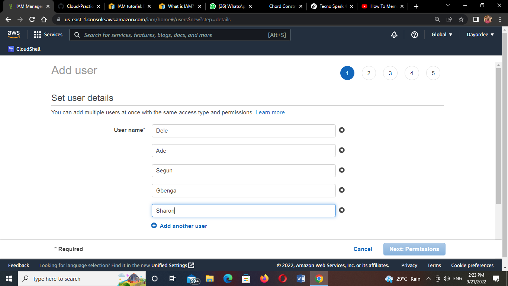
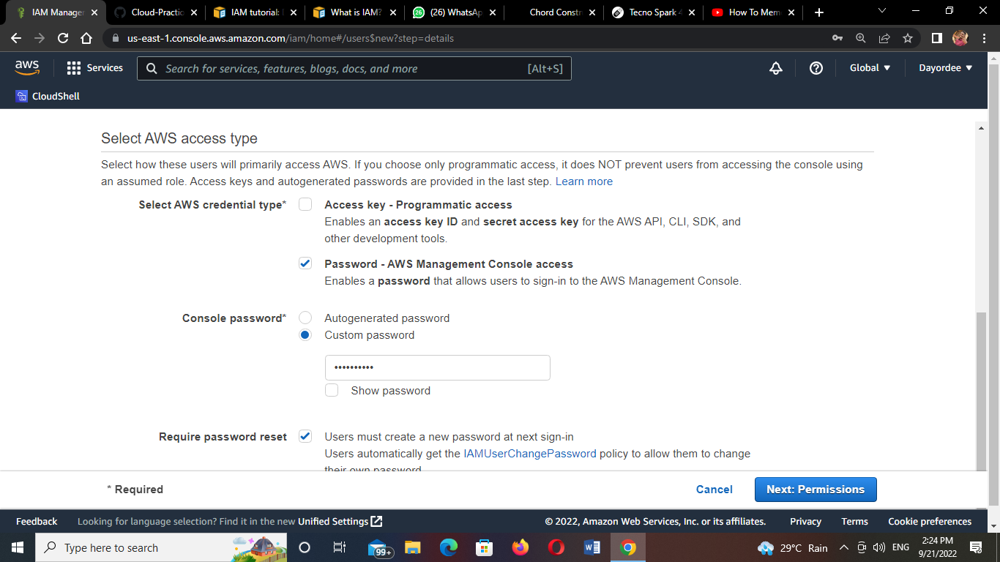
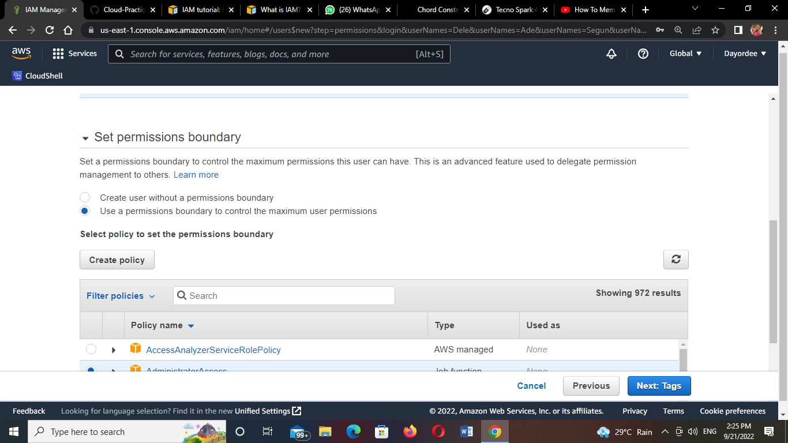
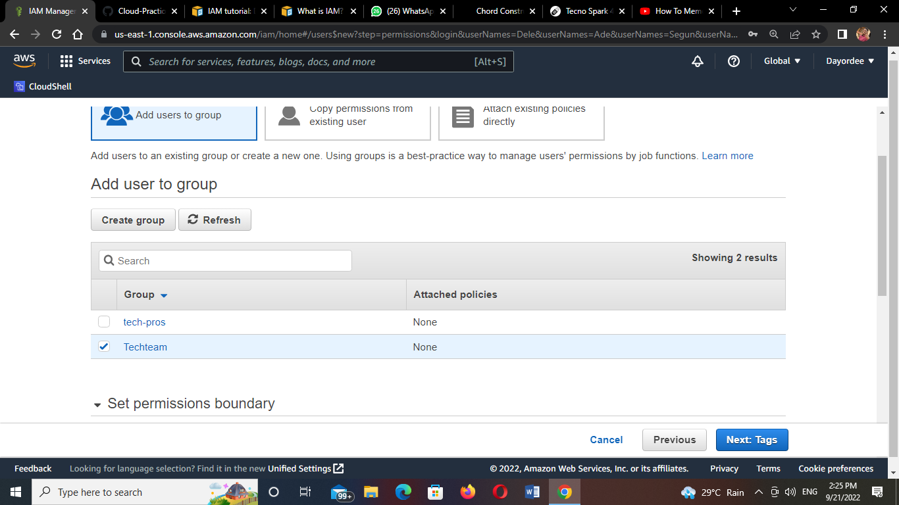
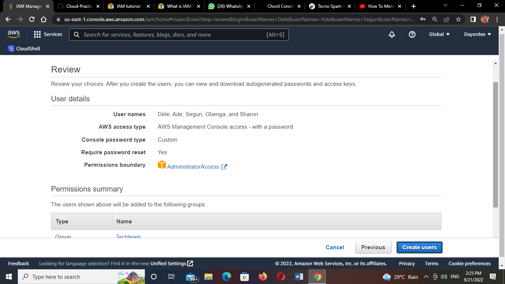
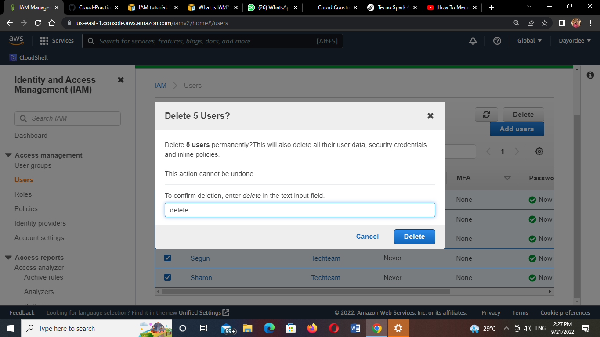
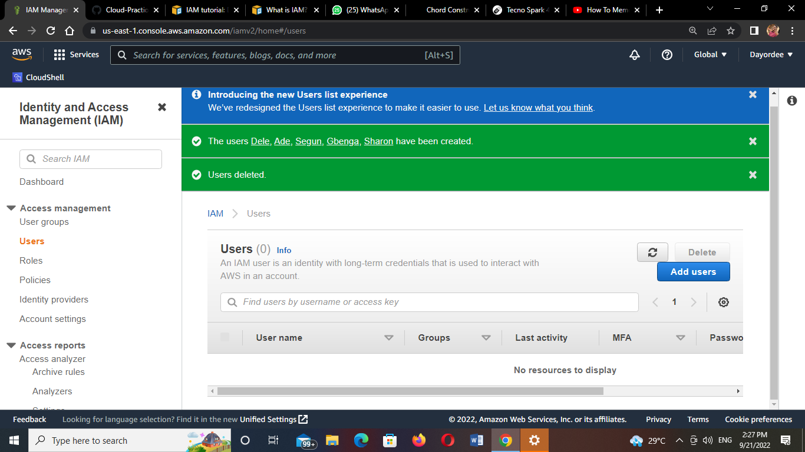

# Identity and Access Management (IAM)

## Task

In an organization demo.io, they have 5 people in different unit as listed:

i.   Dele     technical expert 

ii.  Ade      technical support

iii. Segun    Storage expert

iv.  Gbenga   Admin support

v. Sharon  Finance head

Your task in this lab is to create 

1. Groups and add the corresponding user
2. Enforce a password policy
3. Perform clean up operations

Guides:
https://docs.aws.amazon.com/IAM/latest/UserGuide/introduction.html

1. I created a group and created the corresponding user

2. 
a. I enforced a password policy

c.I set the permission boundary

d. I added them to the group I created

e.I reviewed my inputs

f. I went to create my users

3. I performed my clean operations

