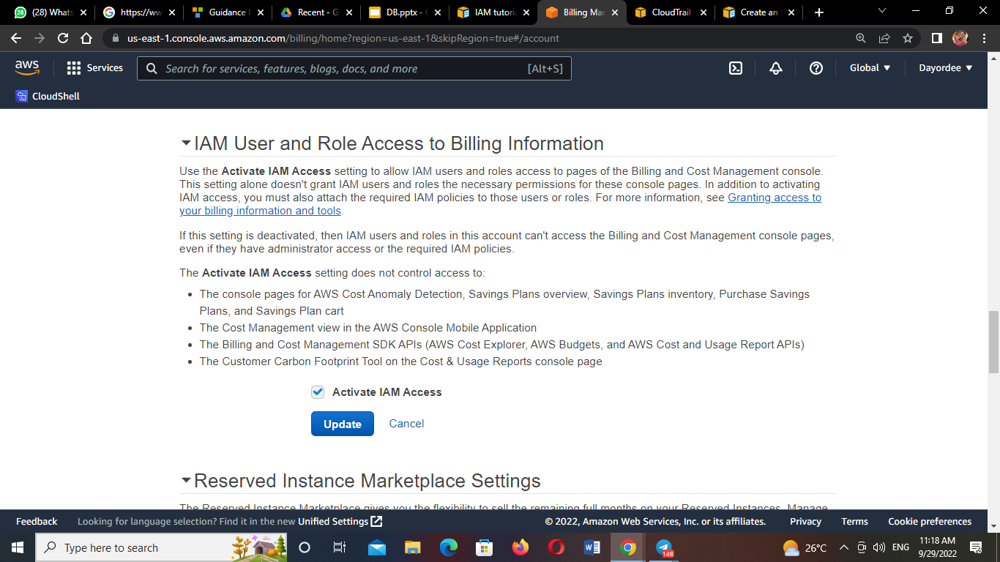
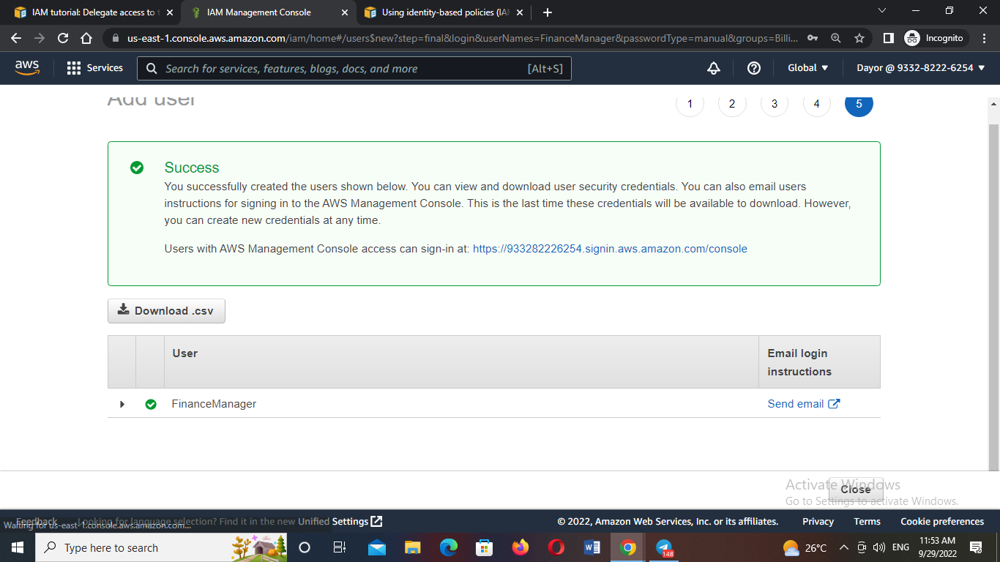
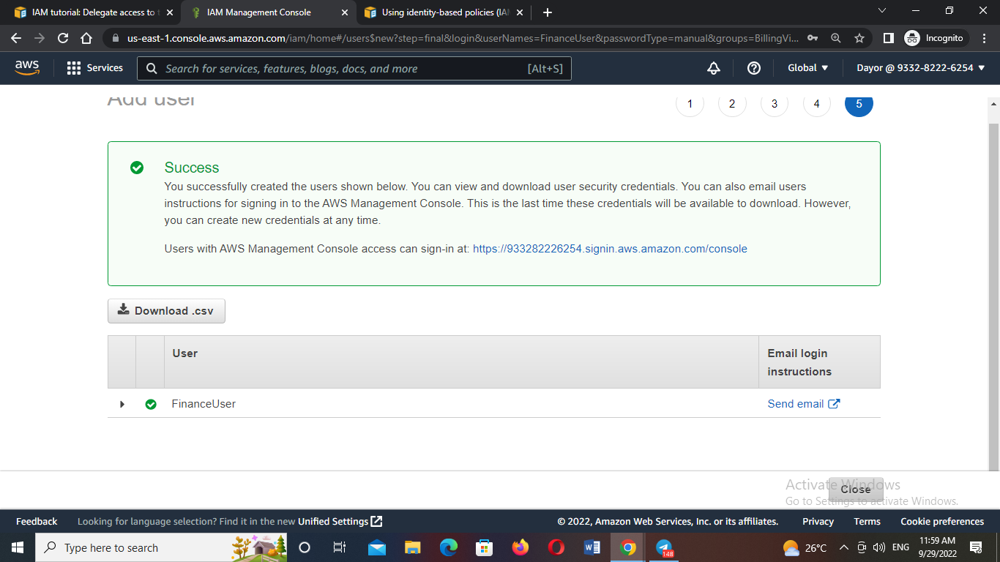
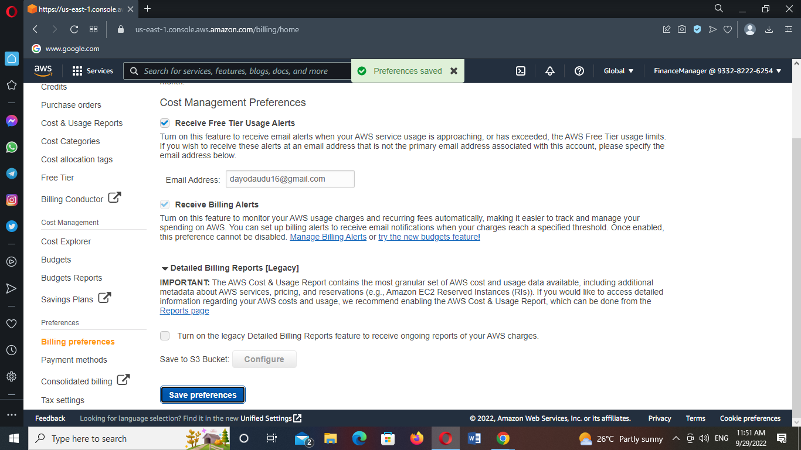
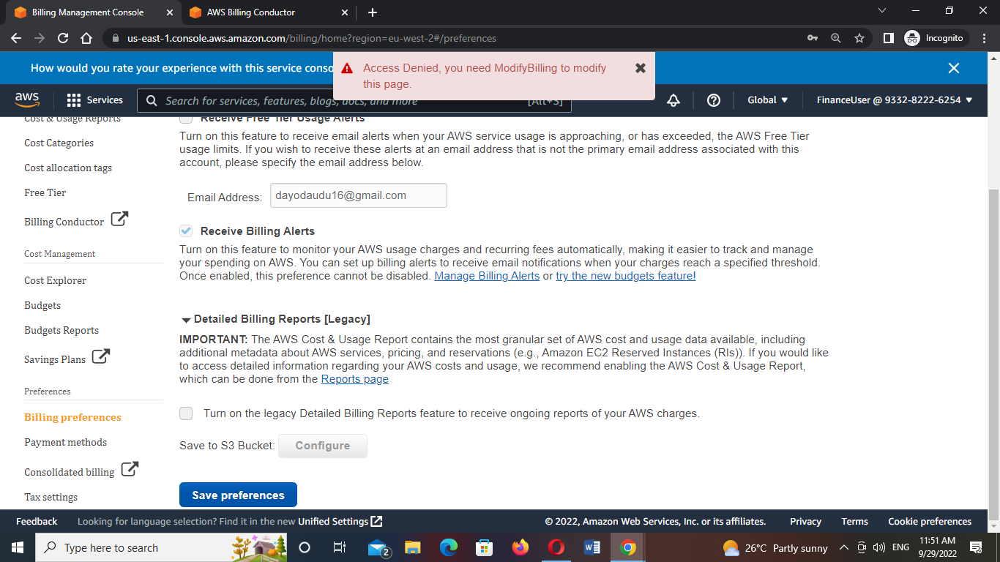
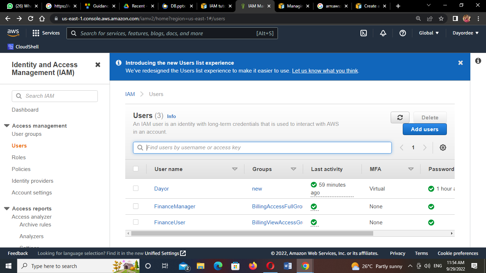

# Identity and Access Management (IAM)

## Working in Billing Unit

The image below shows two employee in the finance unit. They are to be granted workspace on AWS. 

Perform the following task as described on the attached image

Note:
At the end of the lab, you should perform clean up operations.

Guides:

https://docs.aws.amazon.com/IAM/latest/UserGuide/tutorial_billing.html

1. I Activated my IAM access

2. I creater the users fix them in the required groups

3. I created both Policies

4. I tested both users to confirm if the policies I attached works

For:- 
a. Finance Manager that has the Full Billing Access , when I tried modifying the billing preference Access was granted because it has the full Access attached in it's policy created.

b. Finance User had only the read access and cannot modify the billing preference, so access was denied while I tried using it to modify billing preferences.

5. I cleaned Up

.png)
.png)