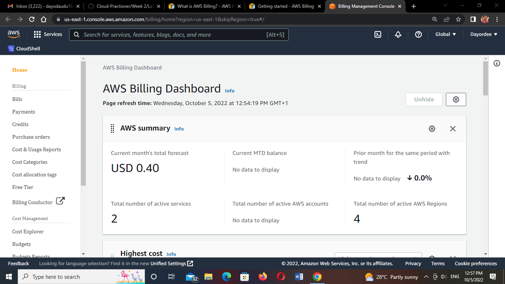
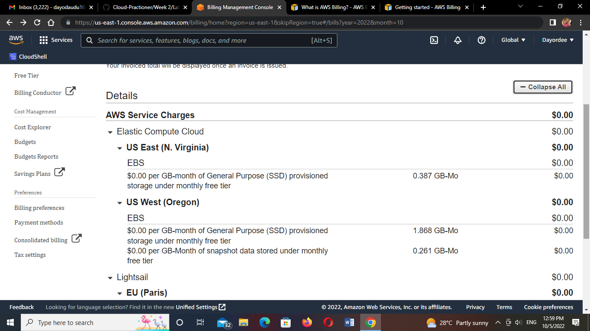
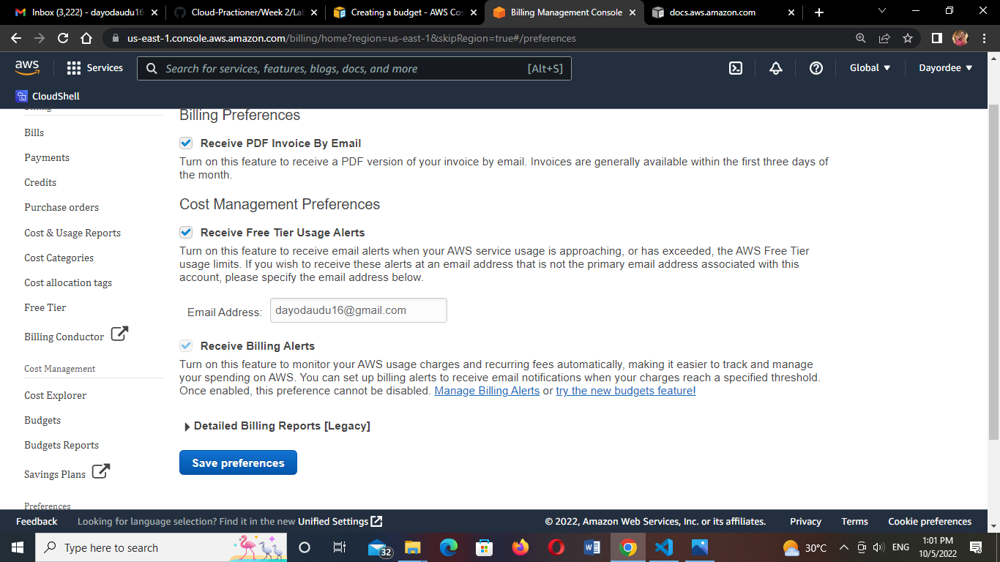
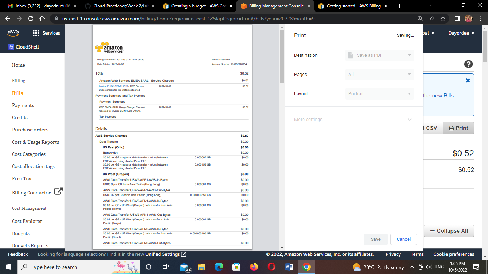
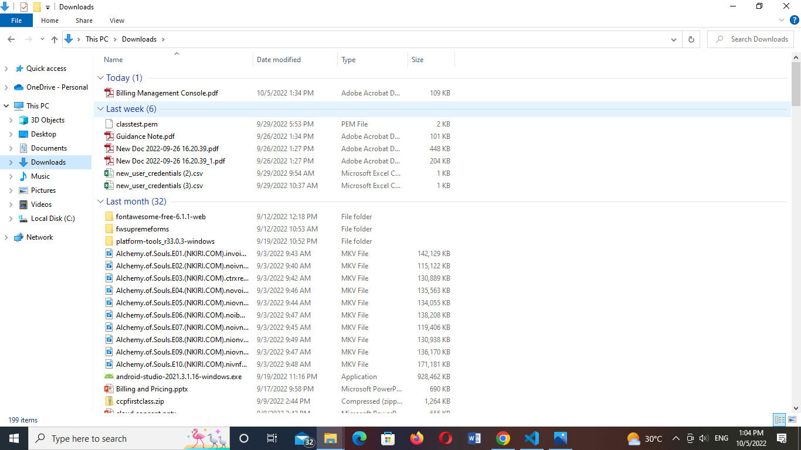

# Working with AWS Billing

## Tasks

1. Attach the required IAM policy to an IAM identity
2. Review your bills and usage
3. Email your Invoice
4. Download or print your bill

Guide: 
https://docs.aws.amazon.com/awsaccountbilling/latest/aboutv2/billing-what-is.html
https://docs.aws.amazon.com/awsaccountbilling/latest/aboutv2/billing-getting-started.html

1.I attached the required IAM policy in the previous lab
 

2.

3. I set the invoice alert to my Email in preference 
4. I downloaded my bill

