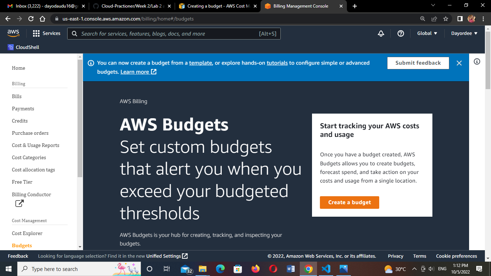

# AWS Free Tier usage alerts using AWS Budgets

## Task:

1. Create a cost budget
2. Create a usage budget

NB: Include Budget alarm at your preferred threshold.

Guide:
https://docs.aws.amazon.com/cost-management/latest/userguide/budgets-create.html

A. Creating a cost budget
1.
2.

B. Creating a usage budget
Select the budget type in customize
.png)
Set your usage budget and Alerts
.png)
.png)
.png)
.png)
.png)
.png)
.png)
.png)
.png)
.png)

Out of the different set of budget provided by AWS you can also filter which to see
.png)
.png)

